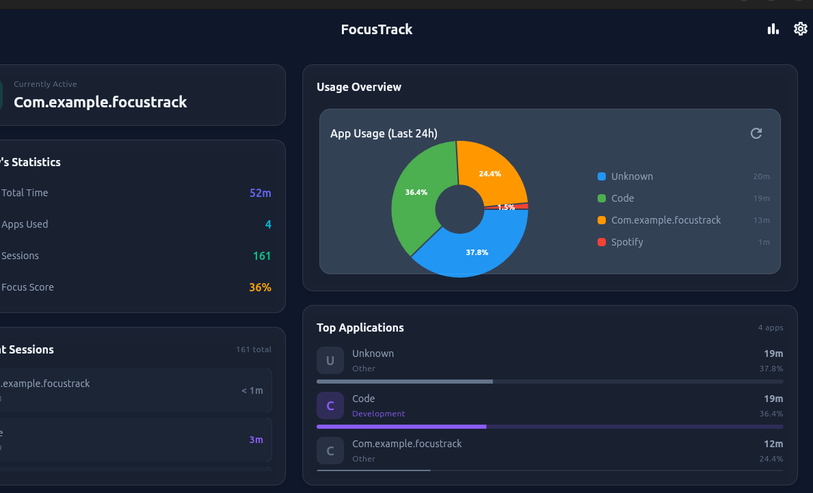

# 🎯 FocusTrack

> **Professional Screen Time Analytics for Desktop**

[](lib/assets/screenshots/dashboard.png)

*Beautiful, minimal, and powerful screen time tracking with advanced analytics*

## ✨ Features

### 📊 Real-Time Tracking
- **Smart Window Detection**: Automatically tracks active applications with intelligent app name extraction
- **Live Activity Monitor**: See what you're working on right now with real-time updates
- **Idle Time Detection**: Distinguishes between active use and idle periods
- **Session Management**: Tracks app switches and session durations

### 📈 Advanced Analytics
- **Multiple Time Views**: Today, Yesterday, This Week, This Month
- **Daily Trend Charts**: Visual bar charts showing usage patterns over time
- **Category Intelligence**: Automatic categorization (Work, Development, Entertainment, etc.)
- **Top Apps Ranking**: Detailed breakdown of most-used applications
- **Focus Score**: Productivity metric based on time spent in productive categories

### 💾 Data Export & Ownership
- **JSON Export**: Complete, machine-readable data format
- **CSV Export**: Spreadsheet-compatible format for Excel/Google Sheets
- **Automatic File Management**: Timestamped exports saved to Documents folder
- **Data Privacy**: All data stored locally, export anytime

### 🎨 Beautiful UI/UX
- **Minimal Two-Column Layout**: Clean, distraction-free interface
- **Glassmorphic Design**: Modern frosted glass effects with subtle animations
- **Dark Professional Theme**: Easy on the eyes with carefully chosen colors
- **Responsive Interface**: Optimized for desktop productivity

## 🚀 Quick Start

### Prerequisites
- **Flutter SDK** (3.9.2+)
- **Linux/Windows/macOS**
- **X11 libraries** (Linux)

### Installation

```bash
# Clone repository
git clone <repository-url>
cd focustrack

# Install dependencies
flutter pub get

# Build native window tracker (Linux)
g++ -o src/active_window_linux src/active_window_linux.cc -lX11

# Run development version
flutter run -d linux
```

### Production Build

```bash
flutter build linux
# Executable: build/linux/x64/release/bundle/focustrack
```

## 📱 How to Use

### Main Dashboard
- **Left Panel**: Current activity, quick stats, and session history
- **Right Panel**: Usage charts and top applications list
- **Analytics Button**: Click the 📊 icon to access detailed analytics

### Analytics Screen
1. **Select Period**: Today, Yesterday, Week, or Month
2. **View Insights**: Charts, breakdowns, and trends
3. **Export Data**: Download JSON or CSV formats

### Data Export
- Open Analytics screen
- Click download icon
- Choose format (JSON/CSV)
- File location shown in notification

## 🛠️ Technical Stack

| Component | Technology | Purpose |
|-----------|------------|---------|
| **UI Framework** | Flutter | Cross-platform interface |
| **Language** | Dart | App logic & state management |
| **State Management** | Riverpod | Reactive data flow |
| **Database** | Drift + SQLite | Persistent data storage |
| **Charts** | FL Chart | Data visualization |
| **Window Detection** | C++/X11 | Native Linux integration |
| **Design** | Material Design 3 | Modern UI components |

## 📊 What You Can Track

### 📅 Time Periods
- **Today**: Current day statistics
- **Yesterday**: Complete previous day analysis
- **This Week**: Monday-to-today overview
- **This Month**: Full month trends

### 📈 Analytics Insights
- Total screen time and session count
- App usage rankings with percentages
- Category distribution (Work vs Entertainment)
- Daily usage patterns and trends
- Productivity focus score

### 🏷️ Smart Categories
- 🏢 **Work**: Office applications
- 💻 **Development**: IDEs, terminals, editors
- 🌐 **Browsers**: Web browsing
- 📧 **Communication**: Email, chat apps
- 🎮 **Entertainment**: Games, media
- 📚 **Productivity**: Tools, utilities
- 🎨 **Creative**: Design, art software

## 🎯 Example Use Cases

### 💼 Productivity Analysis
```
Yesterday: 8h 32m total time
- Development: 5h 12m (62%)
- Communication: 2h 15m (26%)
- Browsers: 1h 05m (12%)
Focus Score: 78%
```

### 📊 Weekly Trends
- Monday: High productivity day
- Wednesday: Peak entertainment usage
- Friday: Balanced work-life mix
- Weekend: Leisure activities dominant

### 🎯 Goal Setting
- Track progress toward screen time goals
- Identify peak productive hours
- Optimize work environment setup

## 🔧 Configuration

### Database Location
- **Linux**: `~/.local/share/focustrack/`
- **Windows**: `%APPDATA%\focustrack\`
- **macOS**: `~/Library/Application Support/focustrack/`

### Export Location
- **All Platforms**: Documents folder
- **Format**: `focustrack_export_YYYY-MM-DDTHH-MM-SS.{json|csv}`

## 🚀 Future Roadmap

- [ ] **Cross-Platform**: Windows & macOS native support
- [ ] **Custom Date Ranges**: Select any time period
- [ ] **App Blocking**: Time limits and restrictions
- [ ] **Notifications**: Usage reminders and goals
- [ ] **Cloud Sync**: Multi-device data synchronization
- [ ] **Advanced Reports**: PDF exports and email reports
- [ ] **Goals & Achievements**: Gamification features

## 🤝 Contributing

We welcome contributions! Here's how you can help:

### 🐛 Bug Reports
- Use GitHub Issues
- Include screenshots and reproduction steps
- Specify your OS and Flutter version

### 💡 Feature Requests
- Check existing issues first
- Describe the use case clearly
- Include mockups if possible

### 🛠️ Code Contributions
```bash
# Fork and clone
git clone https://github.com/yourusername/focustrack.git
cd focustrack

# Create feature branch
git checkout -b feature/amazing-new-feature

# Make changes and test
flutter test
flutter run -d linux

# Submit pull request
```

## 📄 License

```
MIT License - feel free to use this project for personal or commercial purposes
```

## 🙏 Acknowledgments

- **Flutter Team** for the amazing framework
- **Drift** for the excellent database solution
- **FL Chart** for beautiful data visualization
- **Material Design** for the design system

---

**Built with ❤️ for better productivity tracking**

*Transform your screen time data into actionable insights*

